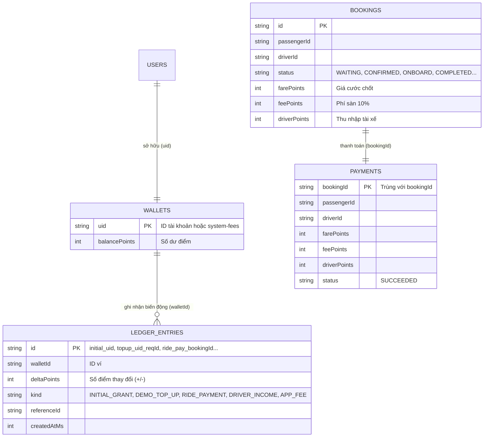
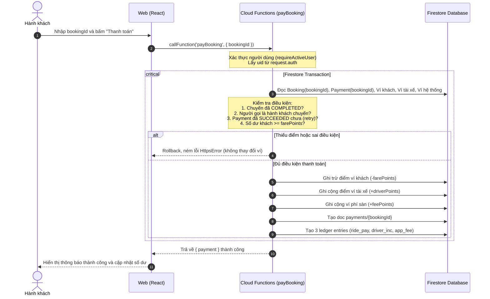

# BÁO CÁO & HƯỚNG DẪN NGƯỜI 5 — VÍ ĐIỂM DEMO & THANH TOÁN
**Dự án:** Về Cùng — Hệ thống ghép xe sinh viên HUST (IT3180)  
**Vai trò:** Người 5 (Phụ trách Ví điểm demo, Lịch sử biến động Ledger và Thanh toán chuyến đi)

---

## 1. Tổng quan các việc đã hoàn thành

Toàn bộ yêu cầu của Người 5 trong kế hoạch môn học đã được triển khai và kiểm thử 100%:
1. **Frontend React (`web/src/modules/wallets/WalletsPage.tsx`)**:
   - Hiển thị trực quan số dư điểm mô phỏng của tài khoản đăng nhập.
   - Nút **"Thêm 100.000 điểm thử"** với cơ chế chống bấm lặp (tạo `requestId` độc nhất cho mỗi lần bấm).
   - Form thanh toán chuyến đi khi khách xuống xe bằng mã đặt chuyến (`bookingId`).
   - Danh sách lịch sử biến động số dư (**Ledger**) hiển thị chi tiết: ngày giờ, loại giao dịch (Cấp ban đầu, Nạp thử, Trả tiền chuyến đi, Thu nhập tài xế, Phí hệ thống), số điểm cộng (xanh) / trừ (đỏ).
   - CSS đồng bộ, hỗ trợ dark/light theme, responsive di động.
2. **Backend Cloud Functions (`functions/src/modules/wallets/index.ts`)**:
   - `getMyWallet`: Lấy ví & lịch sử, tự động cấp 1.000.000 điểm demo đúng một lần (`initial_${uid}`).
   - `topUpDemo`: Thêm cố định 100.000 điểm thử (backend ấn định mức nạp, không tin FE), chống nạp trùng lặp qua `requestId` (`topup_${uid}_${requestId}`).
   - `payBooking`: Thanh toán chuyến đi `COMPLETED`. Sử dụng **Firestore Transaction** đọc Booking, Payment, các Ví (khách, tài xế, hệ thống) trước khi ghi. Trừ khách, cộng tài xế sau phí (10%), cộng ví phí sàn hệ thống `system-fees`. Ghi Payment document và 3 Ledger entries với ID xác định.
   - `getBookingPayment`: Tra cứu thông tin thanh toán cho khách, tài xế hoặc ADMIN.
3. **Contracts type-safe (`shared/contracts.ts`)**:
   - Khai báo đầy đủ interfaces: `Wallet`, `Payment`, `LedgerEntry`, và `CallableContracts`.
4. **Kiểm thử toàn diện**:
   - **Unit Tests (`tests/unit/wallets.test.ts`)**: 7/7 test cases pass.
   - **Integration Tests (`tests/integration/wallets.test.ts`)**: 7/7 test cases chạy trên Firebase Emulator thật (Auth, Firestore, Functions) pass 100%, kiểm thử:
     - Cấp 1.000.000 điểm lần đầu và gọi lại không bị cấp trùng.
     - Nạp 100.000 điểm thử và chống gọi trùng cùng `requestId`.
     - Thanh toán chuyến đi thành công, kiểm tra số dư 3 ví và 3 ledger entries.
     - Gọi lại thanh toán (retry) không trừ tiền lần hai.
     - Quyền hạn (chỉ khách mới được trả, chỉ chuyến COMPLETED mới được trả).
     - Thiếu điểm: transaction rollback nguyên tử, không làm thay đổi ví nào.
     - Concurrent payments: 2 giao dịch đồng thời không bao giờ làm âm ví.

---

## 2. Kiến trúc dữ liệu (Firestore Collections)



---

## 3. Sơ đồ luồng thanh toán chuyến đi (Sequence Diagram)



---

## 4. Cách chuẩn bị trả lời phỏng vấn & bảo vệ đồ án

Khi thầy/cô hoặc nhóm hỏi về phần của bạn (Người 5), bạn hãy trả lời theo 3 trọng tâm sau:

1. **Tại sao lại dùng Transaction thay vì cập nhật trực tiếp?**
   - *Trả lời:* Trong hệ thống thanh toán, việc trừ điểm khách, cộng điểm tài xế, ghi phí sàn và ghi lịch sử phải diễn ra **nguyên tử (Atomic - ACID)**: hoặc tất cả cùng thành công, hoặc không có thao tác nào được lưu. Nếu không dùng transaction, khi xảy ra sự cố mạng giữa chừng, khách có thể bị trừ điểm nhưng tài xế không nhận được. Ngoài ra, transaction kiểm tra số dư ngay lúc ghi giúp ngăn chặn triệt để lỗi "Race Condition" (2 giao dịch đồng thời làm âm ví).
2. **Cơ chế chống thanh toán trùng (Idempotency) được thiết kế thế nào?**
   - *Trả lời:* 
     - Đối với nạp điểm: sử dụng `requestId` do client sinh ngẫu nhiên. ID của ledger entry là `topup_${uid}_${requestId}`. Nếu bấm lặp lại cùng requestId, hệ thống nhận diện đã tồn tại và trả về số dư hiện tại mà không cộng thêm.
     - Đối với thanh toán chuyến: document ID của collection `payments` được đặt chính là `bookingId`. Khi nhận request, transaction kiểm tra nếu payment của bookingId đó đã có trạng thái `SUCCEEDED` thì lập tức trả về kết quả thành công mà không trừ tiền lần hai. ID của các ledger entries cũng được đặt cố định theo mẫu: `ride_pay_${bookingId}`, `driver_inc_${bookingId}`, `app_fee_${bookingId}`.
3. **Bảo mật và phân quyền ra sao?**
   - *Trả lời:* Client không được cấp quyền đọc/ghi Firestore trực tiếp (Firestore Rules chặn `allow read, write: if false`). Mọi nghiệp vụ phải qua Cloud Functions. Backend lấy `uid` từ token xác thực `request.auth` đã được Google verify, kiểm tra tài khoản `ACTIVE`, và lấy giá cước trực tiếp từ Firestore booking do Người 4 quản lý, không bao giờ nhận số tiền từ client gửi lên.

---

## 5. Các lệnh kiểm tra đã chạy thành công

```bash
# 1. Kiểm tra toàn bộ kiểu TypeScript
npm run typecheck

# 2. Build toàn bộ dự án
npm run build

# 3. Chạy unit tests
npm test

# 4. Chạy integration tests với Firebase Emulator
npm run test:integration

# 5. Hoặc chạy toàn bộ bộ kiểm tra:
npm run check
```
Tất cả đều đạt **Exit Code 0** (100% Passed).
